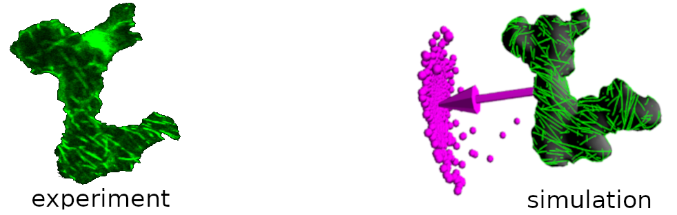

# corticalsim3D (cortical microtubule dynamics)



CorticalSim is a simulator for cortical microtubule dynamics (CMT) on experimentally extracted microscopic images of cells.

Application:

https://www.sciencedirect.com/science/article/pii/S0960982218309242

https://journals.plos.org/ploscompbiol/article?id=10.1371/journal.pcbi.1005959

## Note

Testing and contributing is very welcome, especially if you can contribute with new algorithms and features.

# Installation

Currently, `corticalsim3D` depends on Eigen and Boost (although the latter is planned for removal as a dependency). These dependencies are managed automatically by [Meson](https://mesonbuild.com/index.html), which is also used to build the executables. You do need a fairly recent C++ compiler (GCC or Clang) supporting the C++ 17 standard. The following instructions outline the process of installing the core dependencies on different platforms, as well as compiling and installing `corticalsim3D` itself.

### Linux

The dependencies are handled by Meson, so the only packages that you need to install manually are GCC, Meson, Ninja and CMake.

#### Ubuntu

```shell
sudo -- sh -c 'apt update && apt upgrade && apt install gcc meson ninja-build cmake'
```

#### Arch

```shell
sudo pacman -Sy gcc meson ninja cmake
```

### Windows

#### MSYS2

MSYS2 is a platform that allows you to install development toolchains.

1. Download and install [MSYS2](https://www.msys2.org) (follow the instructions on the main page).
2. Launch the `MSYS2 UCRT64` shell from the system menu.
3. Install the UCRT64 versions of the necessary tools:

```shell
pacman -S mingw-w64-ucrt-x86_64-{gcc,meson,cmake,ninja,pkgconf}
```

You can now move on to the instructions on how to compile CorticalSim. Please note that you should use the MSYS2 shell (the one you launched in step 2 above), not the default Windows command shell or PowerShell.

## Compilation

First, clone the `corticalsim3D` repository and enter the repository root:

```shell
git clone https://github.com/corticalsim/corticalsim3D
cd corticalsim3D
```

### Build script

You can use the build script located under the `scripts` directory:

```shell
./scripts/build.sh
```

The script will create a build directory for the default build type (`release`). The script supports the following arguments:


| Option                    | Description                                                                                                                                                         | Default                   |
| :------------------------ | ------------------------------------------------------------------------------------------------------------------------------------------------------------------- | ------------------------- |
| `--reconfigure`           | Reconfigure the build directory. This option is passed on to `meson setup`.                                                                                         | -                         |
| `--clean`                 | Clean the build directory before compiling. This option is passed on to `meson compile`.                                                                            | -                         |
| `--buildtype <BUILDTYPE>` | Specify the build type to use. Valid options are `plain`, `debug`, `debugoptimized` and `release`.                                                                  | `release`                 |
| `--builddir <DIRECTORY>`  | Specify a custom build directory. Please note that in any case the _actual_ build directory will be `<DIRECTORY>/<BUILDTYPE>` (see the `--buildtype` option above). | `<repository root>/build` |

### Manual build

Alternatively, you can run all the setup and compilation steps manually by following the steps below:

1. Run the setup to configure the build:

```shell
mkdir -p build/release
meson setup build/release . --buildtype release"
```

This command uses the Meson build system to bootstrap everything that we need for the compilation into a directory called `build/release` from the sources located in the current directory.

NOTE: The possible options for the `--buildtype` switch are `plain`, `debug`, `debugoptimized` and `release`. Please check the [Meson documentation page](https://mesonbuild.com/Running-Meson.html#configuring-the-build-directory) on configuring the build directory for information about the meaning of each of these options. We default to `release` here.

Different build types should go in their own directory, so if you would like to build corticalSim with debug symbols, first you should create a subdirectory for that build:

```shell
mkdir -p build/debug
meson setup build/debug . --buildtype debug
```

2. Compile the source by passing the relevant directory via the `-C` switch.

```shell
meson compile -C build/release
```

This will generate an executable file called `corticalsim3d` in the build directory (e.g., `build/release`).

NOTE: If you are using a very old Meson version (e.g., `<0.54.0`), you need to use `ninja` instead of `meson`, with a slightly different syntax:

```shell
ninja -C build/release
```

## Run

Run the `corticalsim3d` executable from the build directory with the `./config/parameters_ARRAY.txt` parameter file as the first argument:

```shell
./<path-to-build-directory>/corticalsim3d ./config/parameters_ARRAY.txt
```

NOTE: The parameter file has some hardwired path variables. As a result, currently you **must** run `corticalsim3d` from the repository root, regardless of where the build directory is located. This is relevant if you have used the [`--builddir` option](#build-script).

If the program runs correctly, it should print some statistics about the run. For instance, with a `debug` build:

```shell
...

Division plane area: 72.097664
corticalSim vBC.2018
Total running time: 8 seconds.
stochastic events: 1784, deterministic events: 56882.
```

Compare this with the `release` build (should be much faster):

```shell
...

Division plane area: 72.097664
corticalSim vBC.2018
Total running time: 3 seconds.
stochastic events: 1784, deterministic events: 56882.
```
